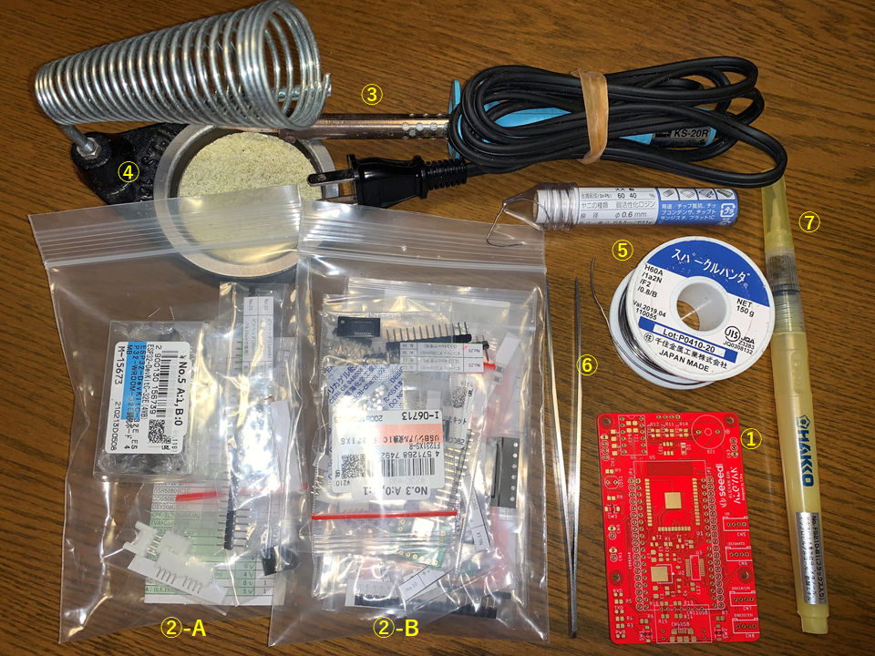
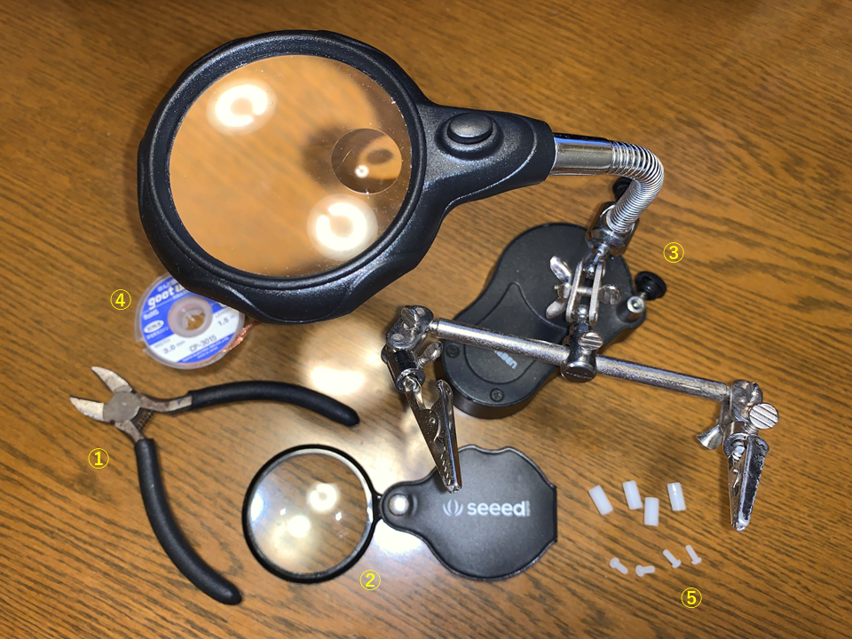
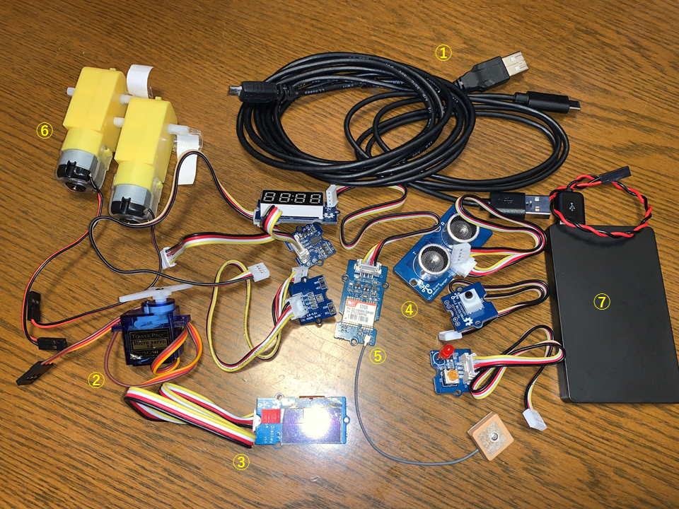
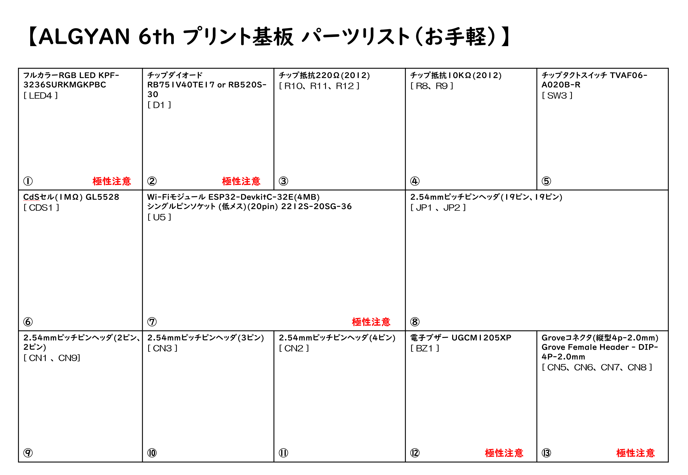
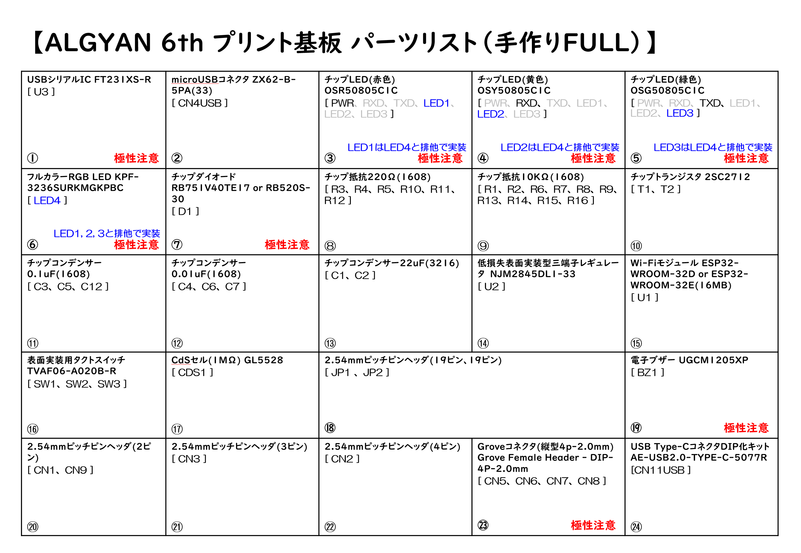

# ALGYAN 6th IoT基板はんだ付けマニュアル

---

## <a name="S0">0. Index</a>

* [事前準備](#S-0)
  * [S-1 道具の確認](#S-1)
  * [S-2 部品の確認](#S-2)

---

## <a name="S-0">事前準備</a>

まずは、ALGYAN6th IoT基板に電子部品をはんだ付けして完成させるために必要な準備を行います。

### <a name="S-1">S-1 道具の確認</a>

#### ・絶対必要なもの(道具＆部品)

1. ALGYAN6th IoT基板
1. 6周年基板用電子部品一式 - 個別に購入した部品でもOK
1. はんだごて - 先の細い20W～30W程度の電子部品はんだ付け用
1. こて台
1. やに入りはんだ線 - できるだけ細いものを推奨(できればΦ0.4mmぐらい、Φ0.6mm以下)
1. ピンセット - 先の尖ったもの
1. [フラックスペン](https://www.amazon.co.jp/dp/B00SKSJFZA)

[↑ Back to Index](#S0)

---

#### ・あると良い道具、その他

1. ニッパ
1. ルーペ
1. ルーペ付き作業台
1. はんだ吸い取り線
1. M2.6スペーサー(10mm以上オスメス)、ビス各4本

スペーサーは、ヘッダピンのはんだ付け時に使います(なくても出来ますが、これを使うと楽になります)。  
その他、[ブラックスクリーナー](https://www.amazon.co.jp/dp/B003B36VWY/)などもあると良いです。

[↑ Back to Index](#S0)

---

#### ・動作確認に利用するもの

1. microUSBケーブル / USB Type-Cケーブル - ESP32-WROOM-32Dへのプログラム書き込みなどに使います(注：充電専用ケーブルは**NG**です。)
1. サーボモーターSG90
1. Grove I2Cセンサー各種 - AHT20, OLED 128x64 etc.
1. Grove DIOモジュール - SW, LED, Ultrasonic Ranger, 4-digit 7seg LED etc.
1. Grove UARTセンサー - GPSモジュール etc.
1. DCモーター(2個)
1. モバイルバッテリー

[↑ Back to Index](#S0)

---

### <a name="S-2">S-2 部品の確認</a>

* "ALGYAN-6th_board_parts_list_setA.pdf" もしくは"ALGYAN-6th_board_parts_list_setB.pdf"を印刷して、パーツに不足がないか確認をしましょう。
  * 左下の番号ははんだ付けの順序になります。
  * 極性のある部品については、このリスト上に「極性注意」の赤字で記載もしています。
    * セットA(お手軽)： [ALGYAN-6th_board_parts_list_setA.pdf](ALGYAN-6th_board_parts_list_setA.pdf)

    * セットB(手作りFULL)：[ALGYAN-6th_board_parts_list_setB.pdf](ALGYAN-6th_board_parts_list_setB.pdf)

[↑ Back to Index](#S0)

---
