# ALGYAN 6th IoT基板はんだ付けマニュアル

---

## <a name="S0">0. Index</a>

* [事前準備](#S-0)
  * [S-1 道具の確認](#S-1)
  * [S-2 部品の確認](#S-2)
* [1. 部品のはんだ付け](＃1)
  * [1-1. Set A(お手軽)](#1-1)
    * [1-1-1. フルカラーRGB LED(LED4)](#1-1-1)
    * [1-1-2. チップダイオード(D1)](#1-1-2)
    * [1-1-3. チップ抵抗(R10、R11、R12)](#1-1-3)
    * [1-1-4. チップ抵抗(R8、R9)](#1-1-4)
    * [1-1-5. 表面実装タクトスイッチ(SW3)](#1-1-5)
    * [1-1-6. CdSセル(U3)](#1-1-6)
    * [1-1-7. Wi-Fiモジュール ESP32DevkitC-32E用ソケット(U5)](#1-1-7)
    * [1-1-8. ピンヘッダ(JP1、JP2)](#1-1-8)
    * [1-1-9. ピンヘッダ(CN1、CN9、CN3、CN4)](#1-1-9)
    * [1-1-10. 電子ブザー(SP1)](#1-1-10)
    * [1-1-11. Groveコネクタ(CN5、CN6、CN7、CN8)](#1-1-11)
  * [1-2. Set B(手作りFULL)](#1-2)
    * [1-2-1. USBシリアルIC(U3)](#1-2-1)
    * [1-2-2. microUSBコネクタ(CN4USB)](#1-2-2)
    * [1-2-3a. チップLED(LED1、LED2、LED3)](#1-2-3a)
    * [1-2-3b. フルカラーRGB LED(LED4)](#1-2-3b)
    * [1-2-4. チップダイオード(D1)](#1-2-4)
    * [1-2-5. チップ抵抗(R3、R4、R5、R10、R11、R12)](#1-2-5)
    * [1-2-6. チップ抵抗(R1、R2、R6、R7、R8、R9)](#1-2-6)
    * [1-2-7. チップ抵抗(R13、R14、R15、R16)](#1-2-7)
    * [1-2-8. チップトランジスタ(T1、T2)](#1-2-8)
    * [1-2-9. チップコンデンサ(C3、C5、C12)](#1-2-9)
    * [1-2-10. チップコンデンサ(C4、C6、C7)](#1-2-10)
    * [1-2-11. チップコンデンサ(C1、C2)](#1-2-11)
    * [1-2-12. 3端子レギュレーター(U2)](#1-2-12)
    * [1-2-13. Wi-Fiモジュール ESP32-WROOM-32D(U1)](#1-2-13)
    * [1-2-14. 表面実装タクトスイッチ(SW3)](#1-2-14)
    * [1-2-15. CdSセル(U3)](#1-2-15)
    * [1-2-16. ピンヘッダ(JP1、JP2)](#1-2-16)
    * [1-2-17. 電子ブザー(SP1)](#1-2-17)
    * [1-2-18. ピンヘッダ(CN1、CN9、CN3、CN4)](#1-2-18)
    * [1-2-19. Groveコネクタ(CN5、CN6、CN7、CN8)](#1-2-19)
    * [1-2-20. USB Type-Cコネクタ(CN11USB)](#1-2-20)

* [2. 動作確認](#2)

---

## <a name="S-0">事前準備</a>

まずは、ALGYAN6th IoT基板に電子部品をはんだ付けして完成させるために必要な準備を行います。

### <a name="S-1">S-1 道具の確認</a>

#### ・絶対必要なもの(道具＆部品)

1. ALGYAN6th IoT基板
1. 6周年基板用電子部品一式 - 個別に購入した部品でもOK
1. はんだごて - 先の細い20W～30W程度の電子部品はんだ付け用
1. こて台
1. やに入りはんだ線 - できるだけ細いものを推奨(できればΦ0.4mmぐらい、Φ0.6mm以下)
1. ピンセット - 先の尖ったもの
1. [フラックスペン](https://www.amazon.co.jp/dp/B00SKSJFZA)

[↑ Back to Index](#S0)

---

#### ・あると良い道具、その他

1. ニッパ
1. ルーペ
1. ルーペ付き作業台
1. はんだ吸い取り線
1. M2.6スペーサー(10mm以上オスメス)、ビス各4本

スペーサーは、ヘッダピンのはんだ付け時に使います(なくても出来ますが、これを使うと楽になります)。  
その他、[ブラックスクリーナー](https://www.amazon.co.jp/dp/B003B36VWY/)などもあると良いです。

[↑ Back to Index](#S0)

---

#### ・動作確認に利用するもの

1. microUSBケーブル / USB Type-Cケーブル - ESP32-WROOM-32Dへのプログラム書き込みなどに使います(注：充電専用ケーブルは**NG**です。)
1. サーボモーターSG90
1. Grove I2Cセンサー各種 - AHT20, OLED 128x64 etc.
1. Grove DIOモジュール - SW, LED, Ultrasonic Ranger, 4-digit 7seg LED etc.
1. Grove UARTセンサー - GPSモジュール etc.
1. DCモーター(2個)
1. モバイルバッテリー

[↑ Back to Index](#S0)

---

### <a name="S-2">S-2 部品の確認</a>

* "ALGYAN-6th_board_parts_list_setA.pdf" もしくは"ALGYAN-6th_board_parts_list_setB.pdf"を印刷して、パーツに不足がないか確認をしましょう。
  * 左下の番号ははんだ付けの順序になります。
  * 極性のある部品については、このリスト上に「極性注意」の赤字で記載もしています。
    * セットA(お手軽)： [ALGYAN-6th_board_parts_list_setA.pdf](ALGYAN-6th_board_parts_list_setA.pdf)

    * セットB(手作りFULL)：[ALGYAN-6th_board_parts_list_setB.pdf](ALGYAN-6th_board_parts_list_setB.pdf)

[↑ Back to Index](#S0)

---

#### ・若松通商のパーツSet A(お手軽)一式を開けて並べた状態

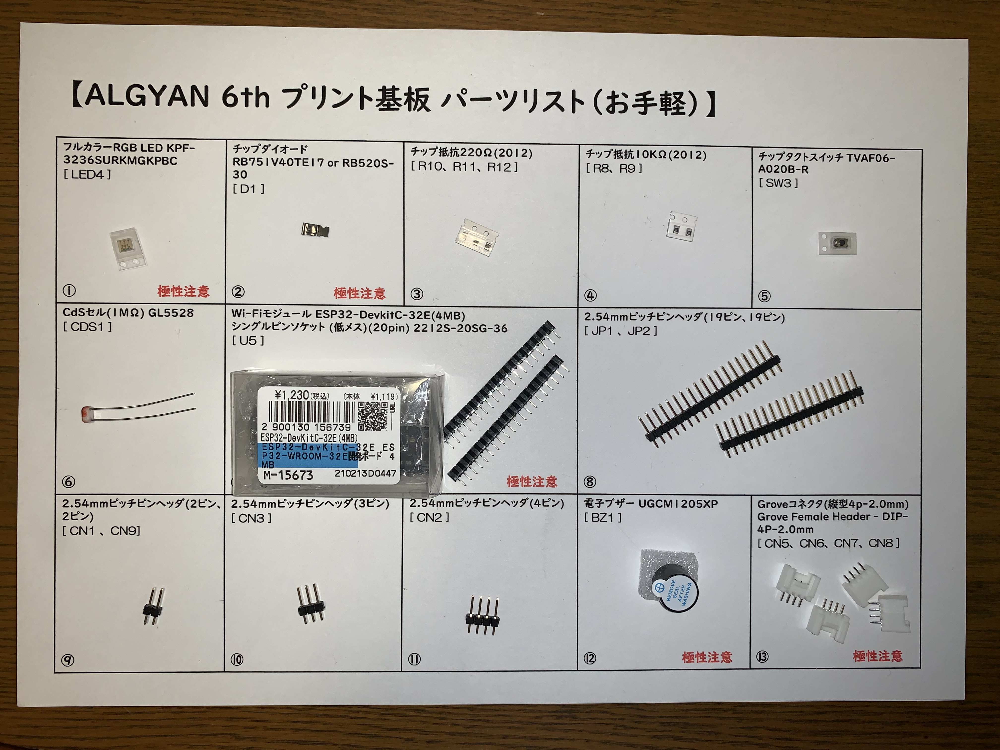

#### ・若松通商のパーツSet B(手作りFULL)一式を開けて並べた状態

こちらはチップLED各色(③、④、⑤)とチップコンデンサ(⑪、⑫)は見分けが付かないので、包装ははんだ付け直前まで開けずにいることを推奨します。

---

## <a name="1-0">1. 部品のはんだ付け</a>

部品のはんだ付けは、高さが低く、小さな部品から、また同じ種類、型式のものをまとめて行っていくと間違いが少なくできます。  
目安として、パーツリストの各部品欄左下の番号順(Set Aは、①～⑬、Set Bは①～㉔)に部品をはんだ付けしていく形になります。  
また、今回の基板は金メッキ基板のため、チップ部品のはんだ付けには必ずランド(※)に予備はんだが必要になります。  

※)ランドとは、部品の取り付け及び接続に用いる導体パターンのことです。  
　表面実装用の場合は「パッド」と呼ぶこともあります。  

### <a name="1-1">1-1. Set A(お手軽)</a>
#### <a name="1-1-1">1-1-1. フルカラーRGB LED(LED4)</a>
フルカラーRGB LED(LED4)には、方向があります。  
下の写真のようにカソード側にマークがついています。  
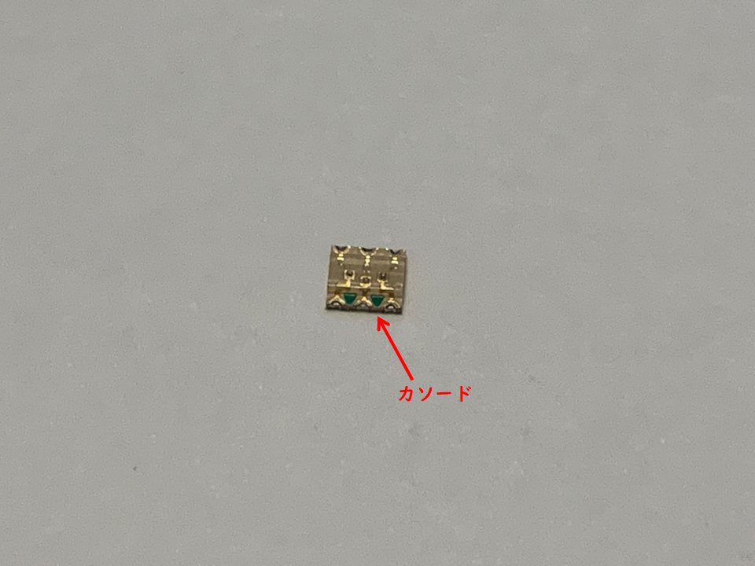

フルカラーRGB LED(LED4)のはんだ付けにおいては、6つのランド(※)の内、1つのランドに予備はんだを盛ります。  
予備はんだを盛るランドは、コーナーやその近くでGNDのようなベタパターンと繋がっていない方に行います。  
(ベタパターンと繋がっているランドには、はんだごての熱が伝わりにくく、はんだがのりにくいので避けます。)  
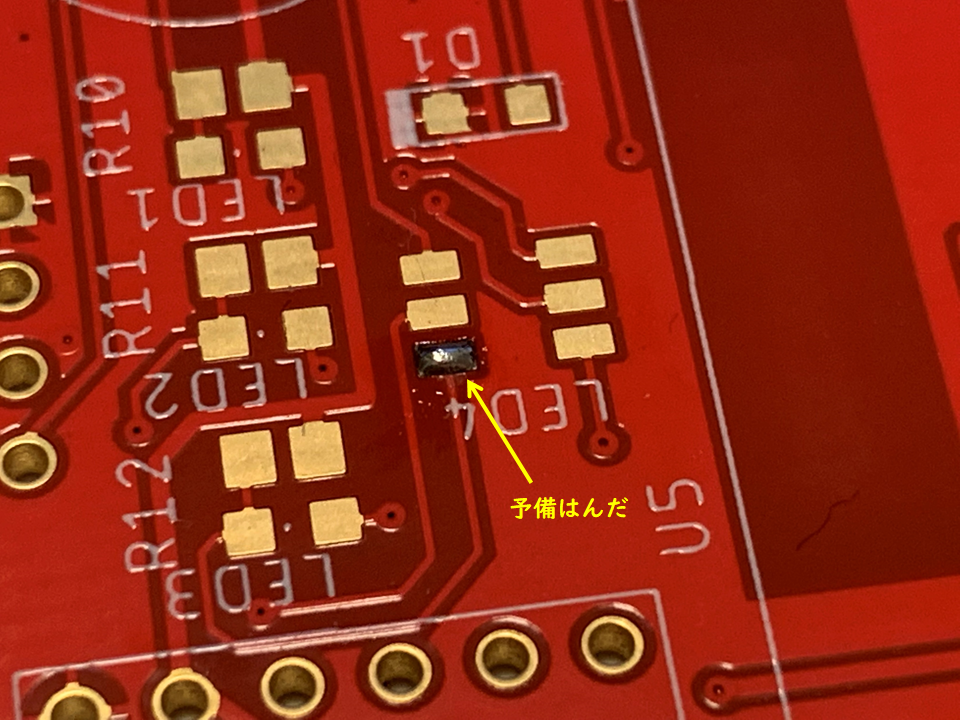

カソードがLED4の「4」の文字の方に来るようにはんだ付けします。  
最初は、予備はんだを付けたランドにLEDをピンセットで摘まんで、位置を合わせて予備はんだをこてで溶かして取り付けます。  
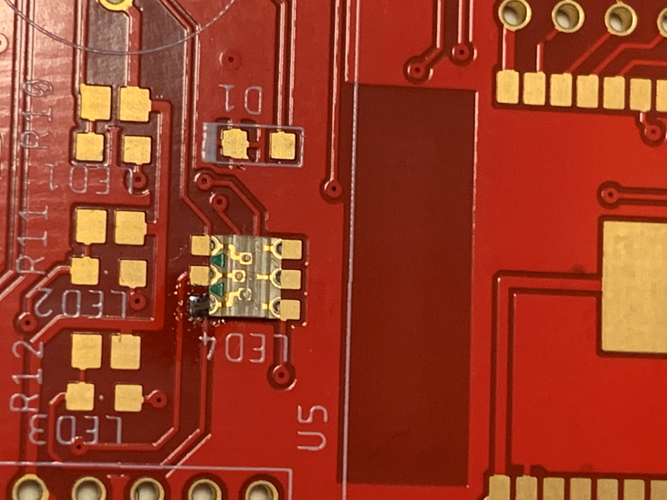

次に対角のランドのはんだ付けをします。  
はんだ付けのコツは、まずこてで基板のランドを1、2秒ぐらい温めます。
その後、はんだを流してつけます。  
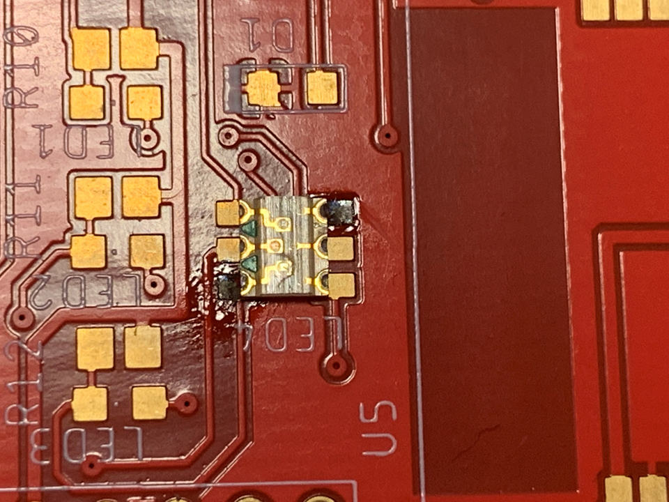

最後に残りのランドのはんだ付けをします。
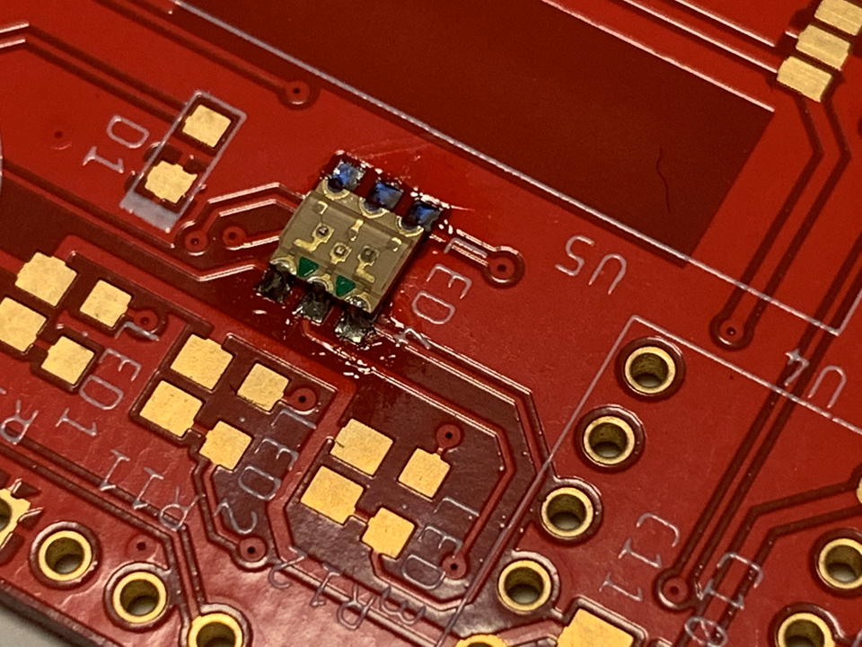

[↑ Back to Index](#S0)

---

#### <a name="1-1-2">1-1-2. チップダイオード(D1)</a>
チップダイオード(D1)にも、方向があります。  
下の写真のようにカソード側にマークがついています。  
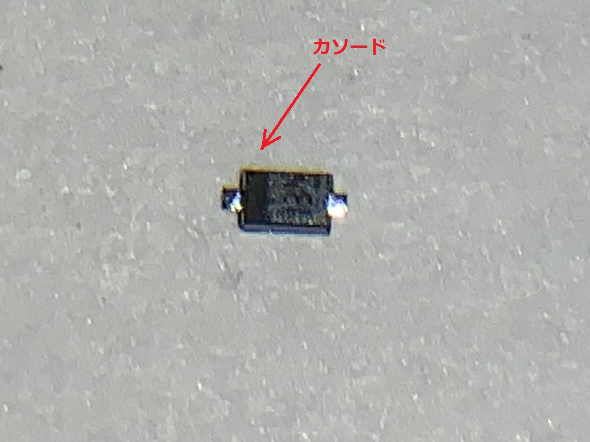

このチップダイオード(D1)のはんだ付けにおいても、同様に片側のランドに予備はんだを盛ります。  
以下の写真は、D1のランド(アノード側)に予備はんだを盛った状態です。  
(カソード側がベタパターンに繋がっているのでアノード側に予備はんだを盛ります。)
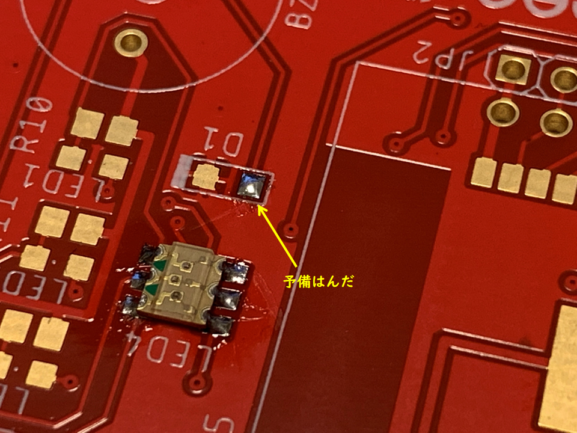

D1のシルクの白いバーの側にカソードが来るようにはんだ付けします。　　
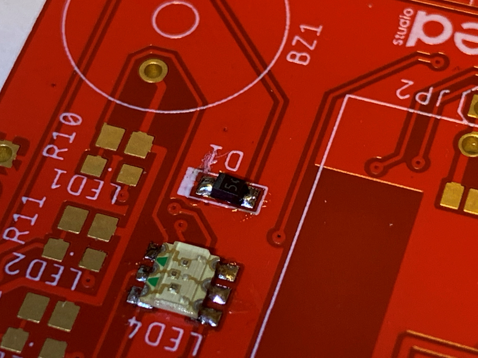

[↑ Back to Index](#S0)

---

#### <a name="1-1-3">1-1-3. チップ抵抗(R10、R11、R12)</a>
チップ抵抗には、表と裏があります。3桁の数字が書いてある黒い面が表で、白い面は裏です。  
表裏を逆にはんだ付けしても、動作には影響ありませんが、表面が見えるようにはんだ付けしましょう。  
片側のはんだ付けが出来たら、反対側をはんだ付けします。  

以下の写真は、R10、R11、R12のランドに予備はんだを盛った状態です。
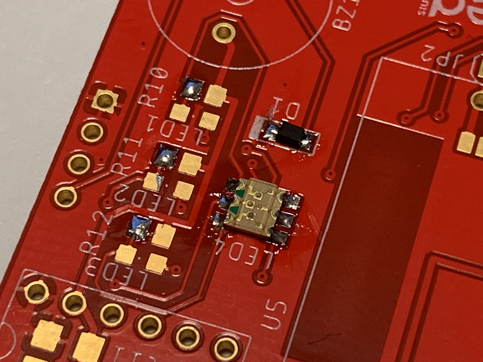

以下の写真は、チップ抵抗(R10、R11、R12)のはんだ付けが終わった状態です。
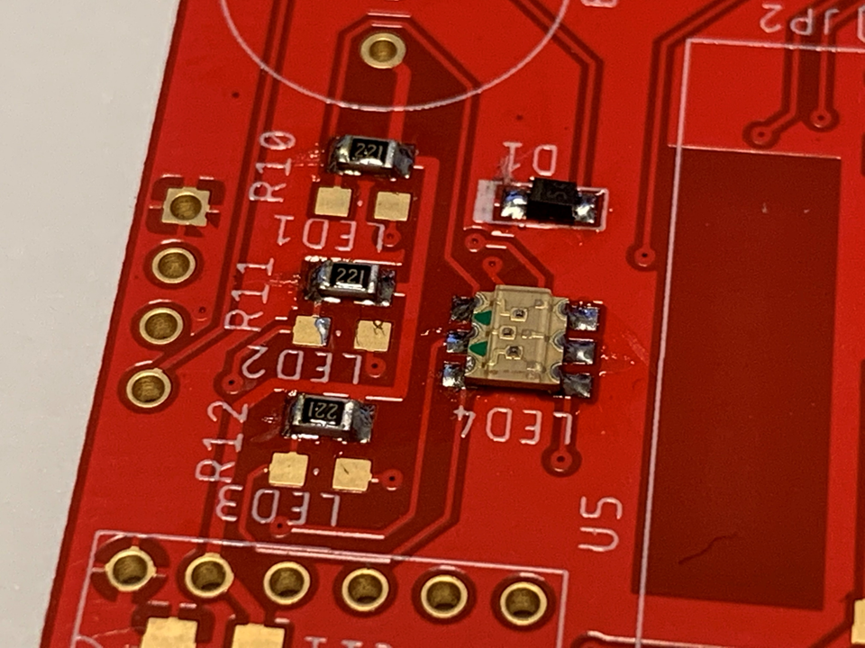

[↑ Back to Index](#S0)

---

#### <a name="1-1-4">1-1-4. チップ抵抗(R8、R9)</a>
チップ抵抗R8、R9も同様にして、はんだ付けを行います。  
以下の写真は、チップ抵抗(R8、R9)のはんだ付けが終わった状態です。
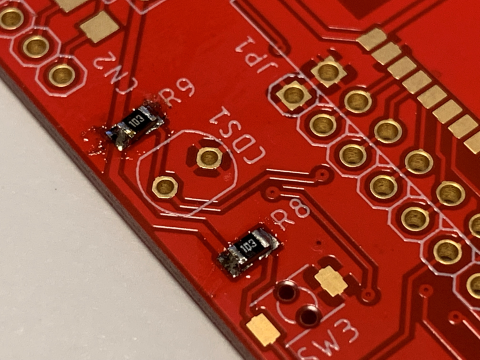

[↑ Back to Index](#S0)

---

#### <a name="1-1-5">1-1-5. 表面実装タクトスイッチ(SW3)</a>
表面実装タクトスイッチ(SW3)は、裏面に小さなピンが出ています。  
このピンを基板の穴に嵌められるため、**予備はんだをせずにはんだ付け**を行います。  

以下の写真は、表面実装タクトスイッチ(SW3)までのはんだ付けが終わった状態です。
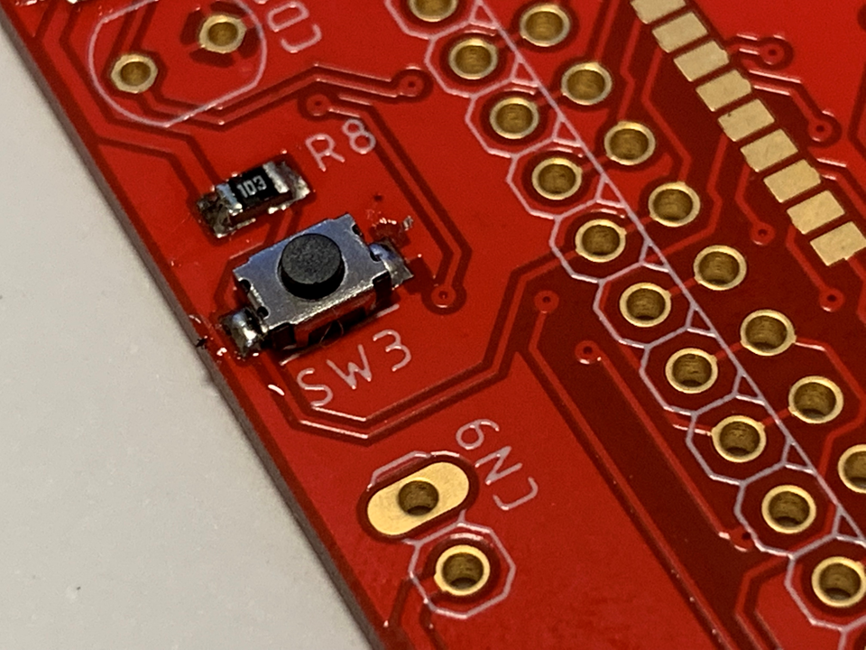

[↑ Back to Index](#S0)

---

#### <a name="1-1-6">1-1-6. CdSセル(CDS1)</a>
CdSセル(CDS1)は、方向のないリード部品です。  
基板の穴にリードを差し込んで、裏から出たリードをすこし外側に広げて余分なリードをニッパで切断します。  
切断した上で、裏面からリードをはんだ付けします。  
写真では、作業台を使って基板を挟んだ状態になっていますが、作業台は使わなくてもOKです。

以下の写真は、CdSセル(CDS1)を基板の穴に差し込んだ状態です。  
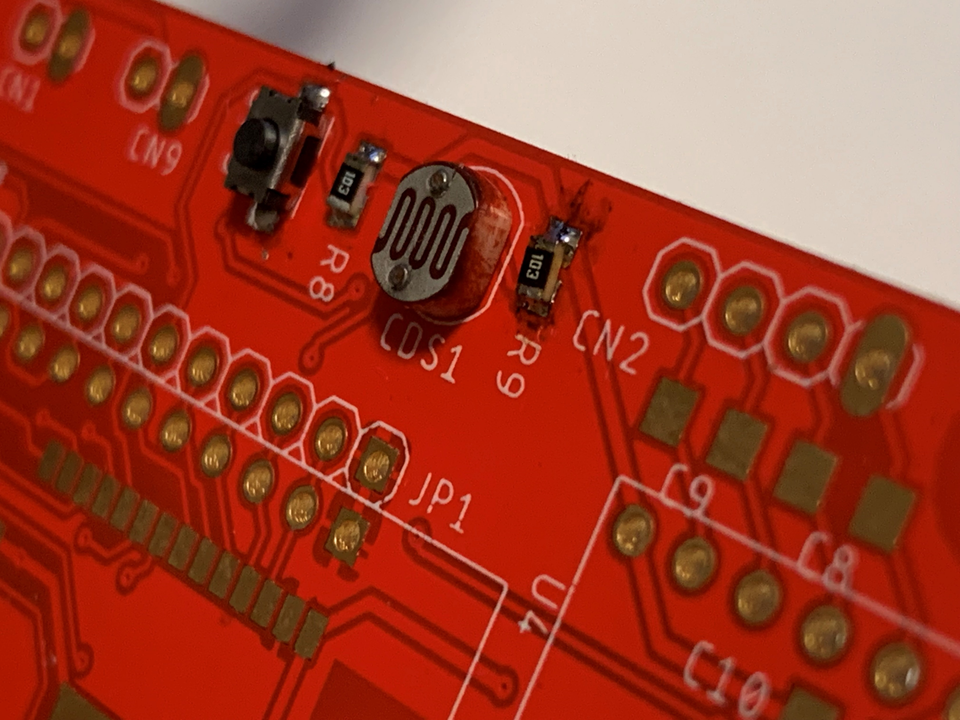

以下の写真は、CdSセル(CDS1)を基板の穴に差し込んだのを裏から見て余分なリードを切断した状態です。
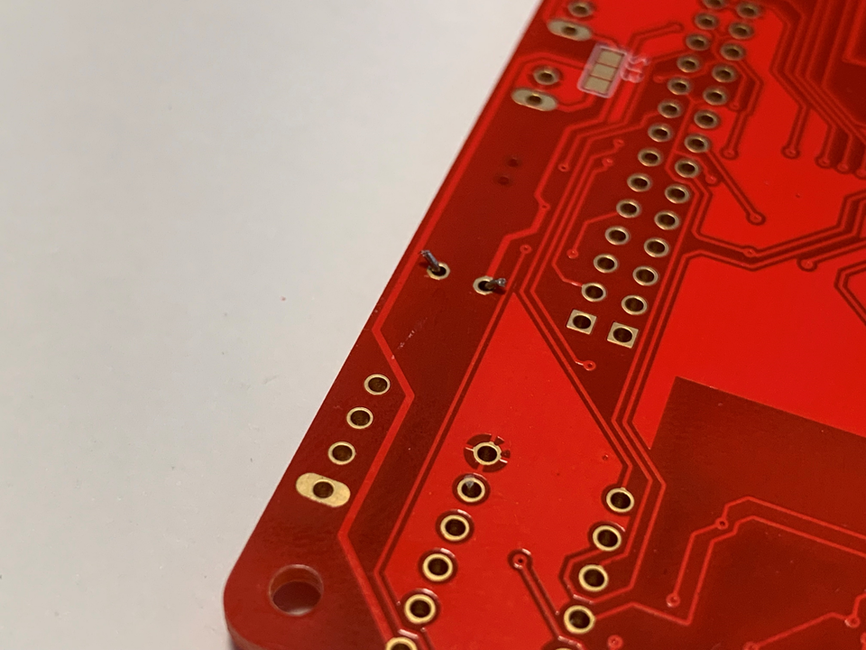

以下の写真は、CdSセル(CDS1)のはんだ付けが終わった状態です。
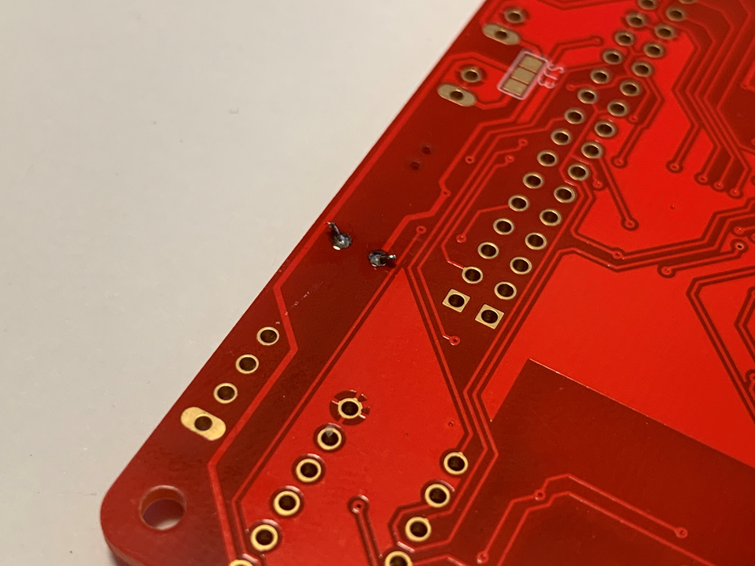

[↑ Back to Index](#S0)

---

#### <a name="1-1-7">1-1-7. Wi-Fiモジュール ESP32DevkitC-32E用ソケット(U5)</a>
ESP32-DevkitC-32Eは、直接はんだ付けせずに、シングルピンソケット(低メス)を使って取り付け、取り外しができるようにします。  
シングルピンソケット(低メス)は20ピンなので、**1ピンを折って切り取り**それぞれ19ピンにしておきます。

以下の写真は、シングルピンソケット(低メス)のはんだ付けが終わった状態です。
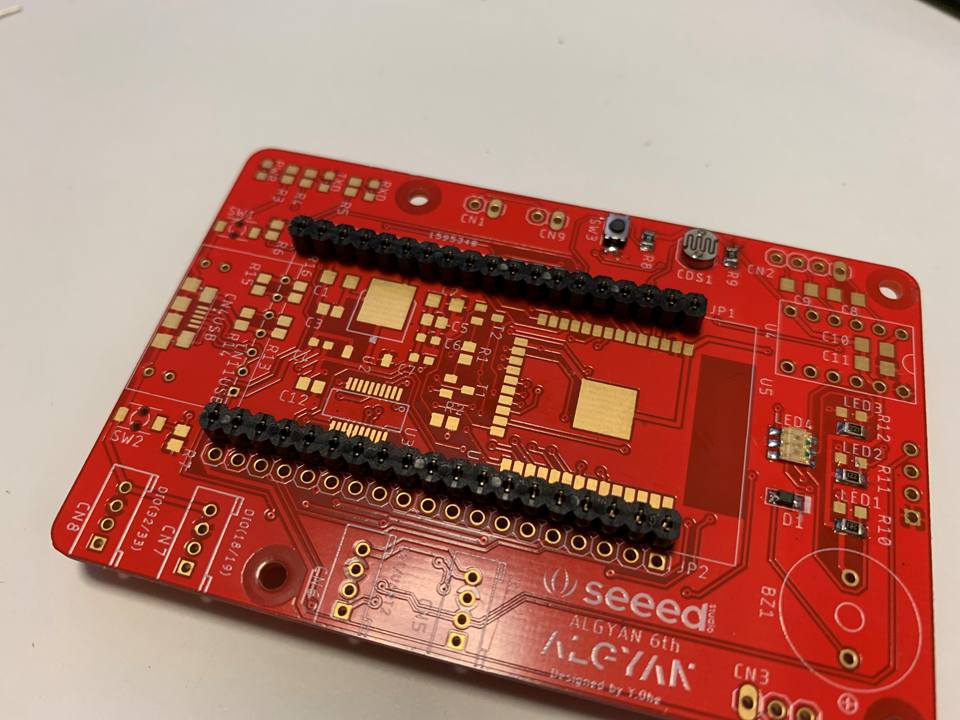

このシングルピンソケット(低メス)をはんだ付けするために、まずESP32-DevKitC-32Eにソケットを嵌めてしまいます。
少し堅いのですが、頑張って嵌めてしまいましょう。
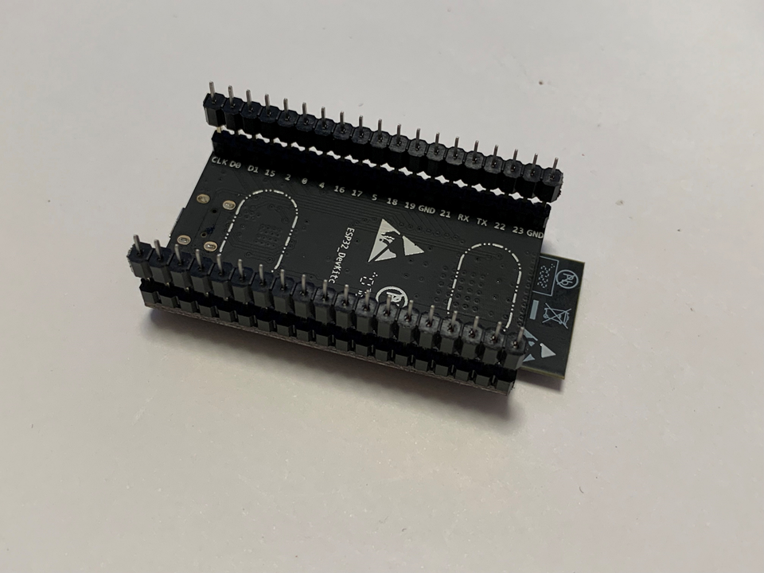

ESP32-DevKitC-32Eを嵌めたシングルピンソケット(低メス)を基板にはめ、裏返してまず各コーナーの2ピンだけをはんだ付けします。  
2ピンのはんだ付けが終わったところで、基板からソケットが浮いていないか、曲がっていないかを確認します。  
浮いていたり、曲がっていたらこのときに修正します。
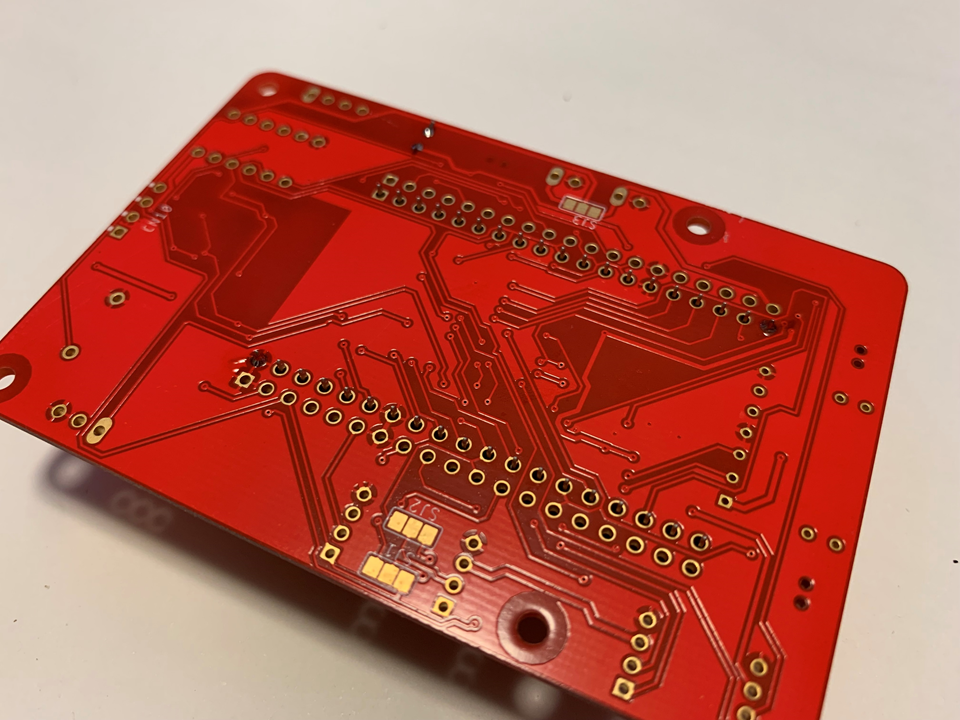

2ピンのはんだ付けに問題なければ、残りのピンのはんだ付けをします。  
全ピンのはんだ付けが終わったらソケットからESP32-DevKitC-32Eを一旦外します。
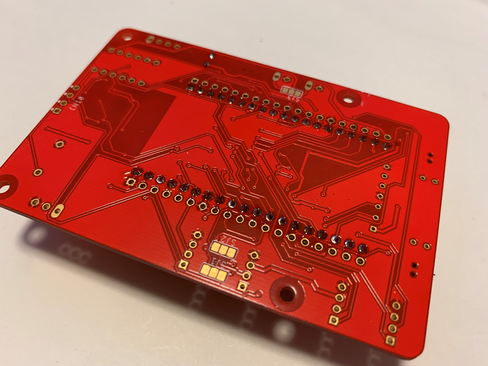

[↑ Back to Index](#S0)

---

#### <a name="1-1-8">1-1-8. ピンヘッダ(JP1、JP2)</a>
続いてESP32-DevKitC-32Eの全ピンを引き出せるようにするピンヘッダをはんだ付けします。  
このピンヘッダは、この基板の回路で未使用のESP32-DevKitC-32Eのピンを使用する場合にジャンパワイヤーなどで信号を引き出せるようにするものです。  
なので、必要に応じてはんだ付けして下さい。  
ピンヘッダは40ピンなので、**19ピン×2つの長さに折って**おきます。

まずピンソケットの外側に並べてJP1、JP2に差し込みはんだ付けします。  
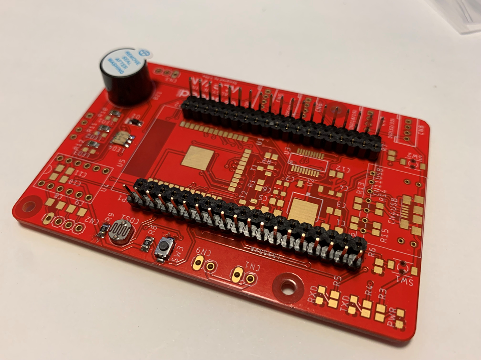

しかし、ピンソケットに当たってしまい、少し左右に開いてしまいます。 m(_　_)m   
でも、気にせずはんだ付けしましょう。  
はんだ付けの要領はピンソケットのときと同様です。
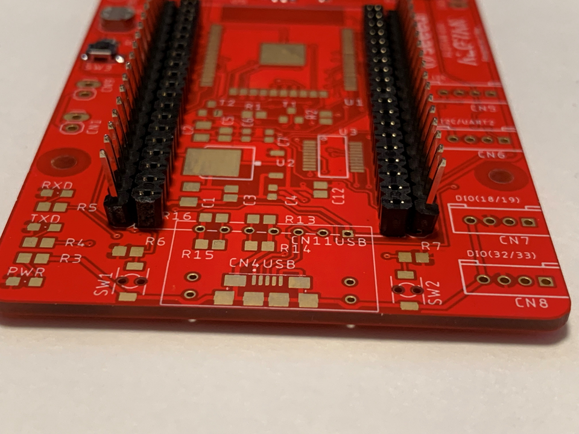

[↑ Back to Index](#S0)

---

#### <a name="1-1-9">1-1-9. ピンヘッダ(CN1、CN9、CN2、CN3)</a>
各コネクタ用のピンヘッダを同様にはんだ付けします。  
コネクタCN2、CN9は、モータドライバDRV8835のモータ駆動用コネクタなので、モータ駆動をしない場合は取り付け不要です。  
コネクタCN3はサーボモータ駆動用コネクタなので、サーボモータを駆動しない場合は取り付け不要です。  

各コネクタのはんだ付けのときも各1本のピンだけはんだ付けが終わったところで、基板からピンヘッダが浮いていないか、曲がっていないかを確認します。  
浮いていたり、曲がっていたらこのときに修正します。  
1本のピンのはんだ付けに問題なければ、残りのピンのはんだ付けをします。  
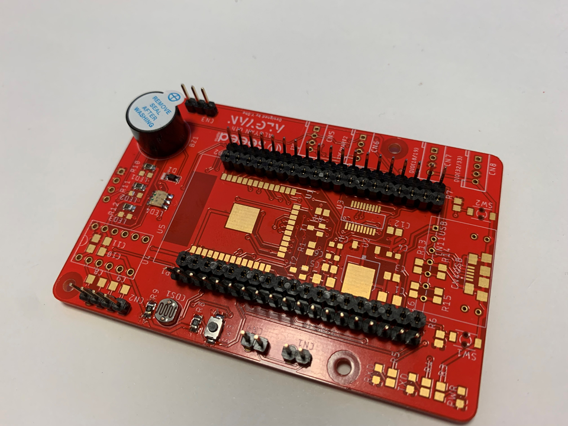

コネクタCN2、CN9をはんだ付けして、モータドライバDRV8835を取り付け、モータ駆動をする場合は、さらに基板裏側のSJ3の片側をはんだ付けしてショートさせる必要があります。  
以下の写真の場合は、CN9からモータ駆動用外部電源を供給する場合のパターンショートの例です。  
CN1の外部電源から供給させる場合は、反対側をショートさせます。
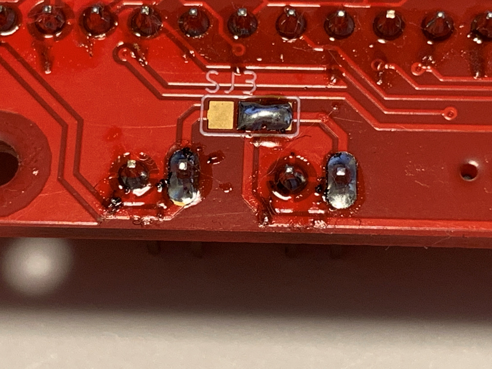

[↑ Back to Index](#S0)

---

#### <a name="1-1-10">1-1-10. 電子ブザー(BZ1)</a>
電子ブザー(BZ1)は、方向があるリード部品です。  
電子ブザー(BZ1)の上部に貼ってあるシールの「+」の方のリードを基板上の「+」のシルクに合わせて基板の穴にリードを差し込みます。  
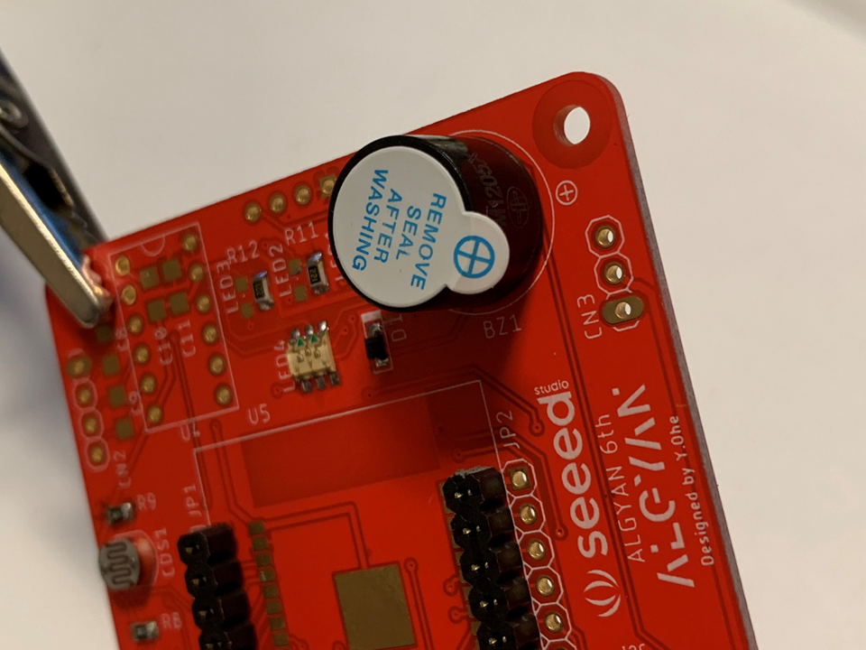

その上で、裏から出たリードをすこし外側に広げて余分なリードをニッパで切断し、裏面からリードをはんだ付けします。  
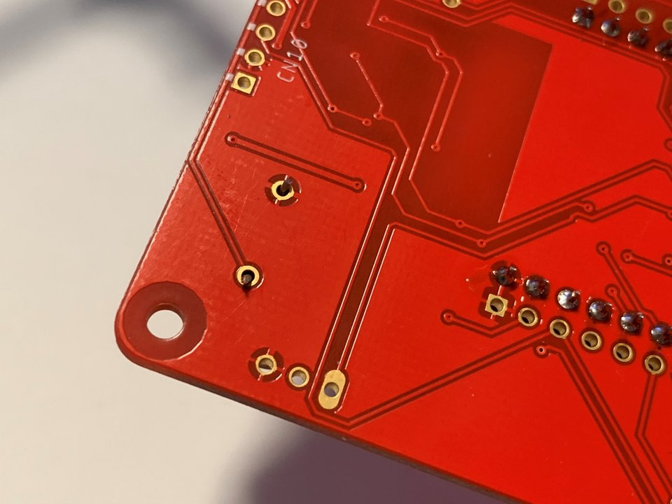

以下の写真は、電子ブザー(BZ1)のはんだ付けまでが終わった状態です。
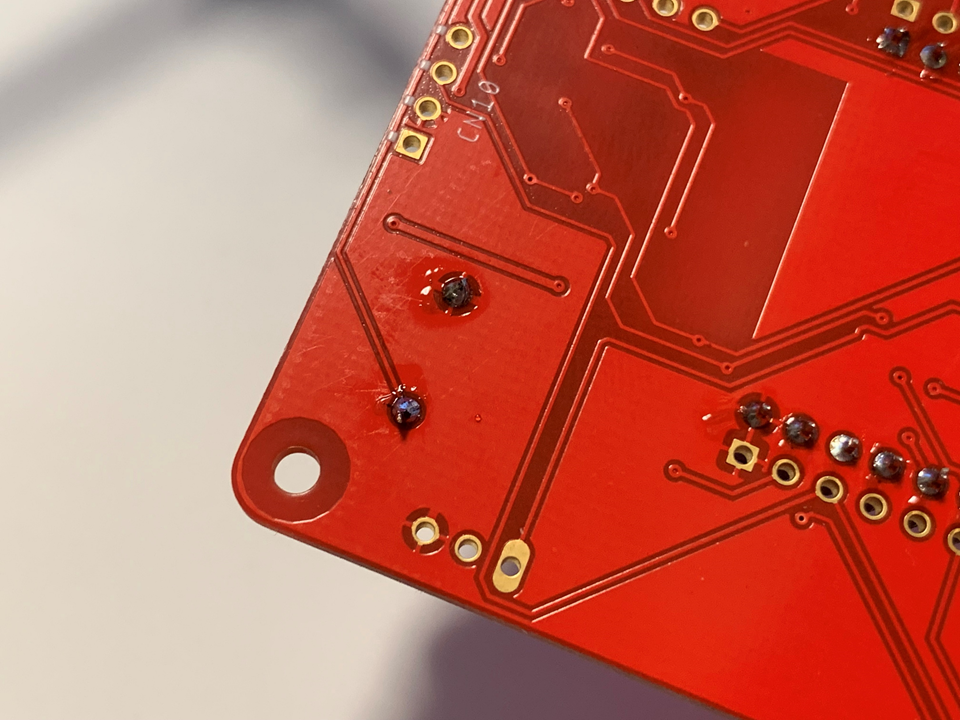

[↑ Back to Index](#S0)

---

#### <a name="1-1-11">1-1-11. Groveコネクタ(CN5、CN6、CN7、CN8)</a>
Groveコネクタ用には方向があります。  
シルクの形状(写真の向き)に合わせ嵌めて、はんだ付けします。  
このときも各1本のピンだけはんだ付けが終わったところで、基板からコネクタが浮いていないか、曲がっていないかを確認します。  
浮いていたり、曲がっていたらこのときに修正します。  
1本のピンのはんだ付けに問題なければ、残りのピンのはんだ付けをします。  
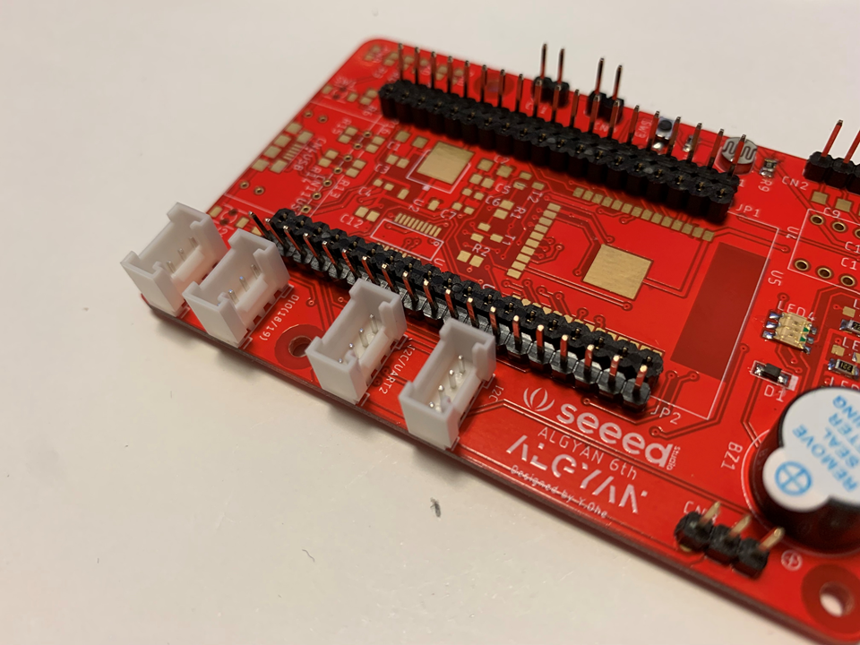

GroveコネクタCN6でUART2通信をする場合は、さらに基板裏側のSJ1、SJ2の片側をはんだ付けしてショートさせる必要があります。  
以下の写真の場合は、GroveコネクタCN6でUART2通信をする場合のパターンショートの例です。  
GroveコネクタCN6でI2C通信をする場合は、反対側をショートさせます。
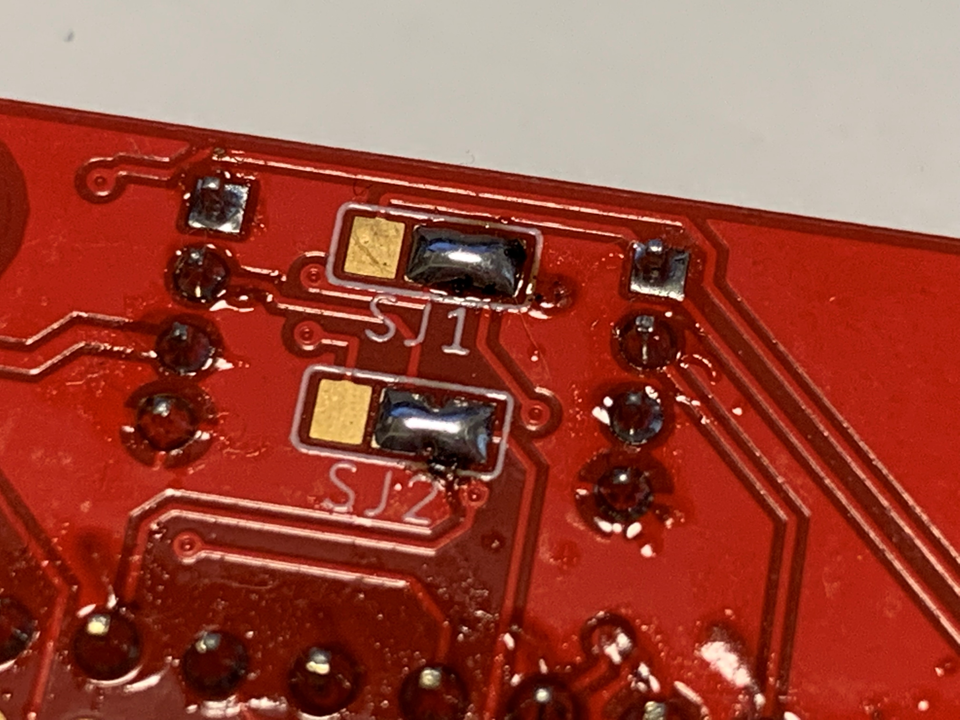

[↑ Back to Index](#S0)

---

### <a name="1-2">1-2. Set B(手作りFULL)</a>
#### <a name="1-2-1">1-2-1. USBシリアルIC(U3)</a>
USBシリアルIC(U3)には、方向があります。  
下の写真のように1番ピンの場所にマークがついています。  
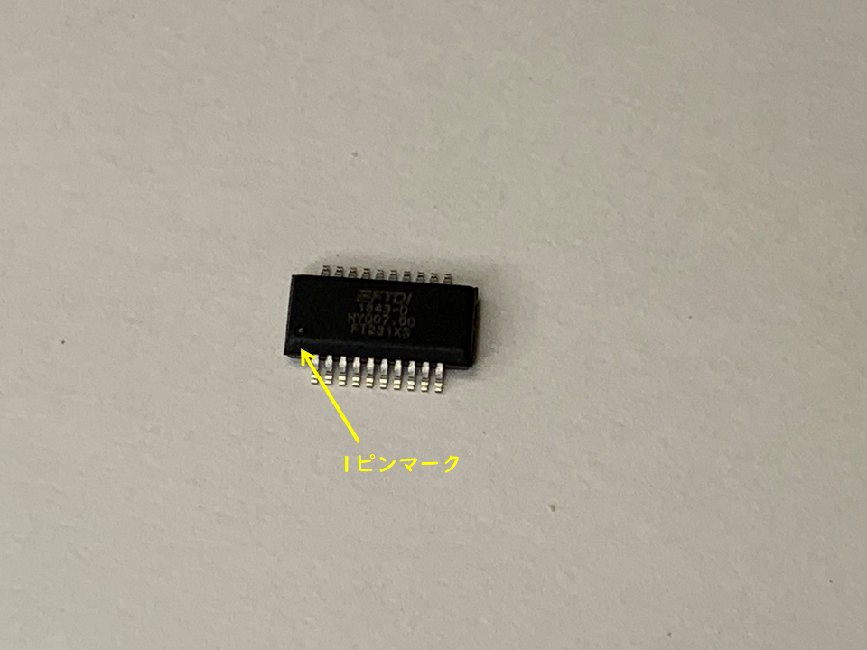

USBシリアルIC(U3)のはんだ付けにおいては、20ピンのランド(※)の内、1つのランド(1番ピンのランド)に予備はんだを盛ります。  
予備はんだを盛るランドは、コーナーやその近くでGNDのようなベタパターンと繋がっていない方に行います。  
(ベタパターンと繋がっているランドには、はんだごての熱が伝わりにくく、はんだがのりにくいので避けます。)  
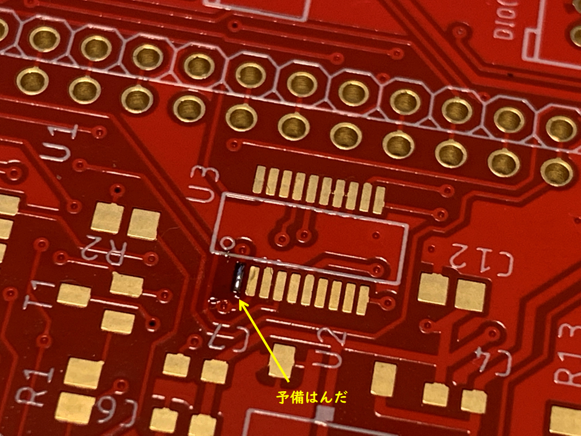

予備はんだを盛った1番ピンランドにICの1番ピンを合わせはんだ付けします。  
最初は、予備はんだを付けたランドにICをピンセットで摘まんで、位置を合わせて予備はんだをこてで溶かして取り付けます。  
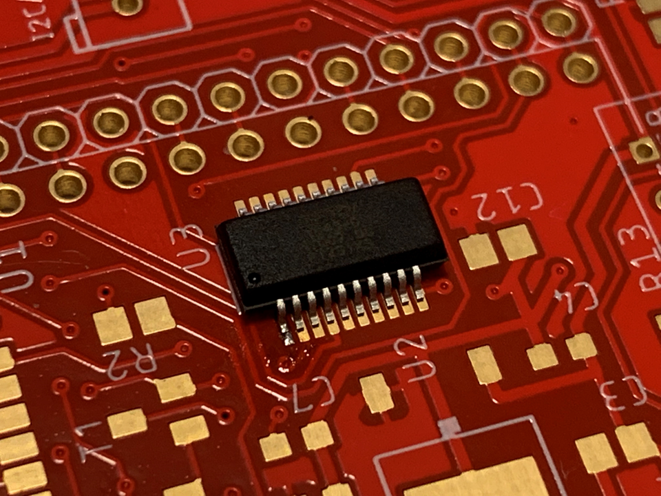

次に対角のランドのはんだ付けをします。  
はんだ付けのコツは、まずこてで基板のランドを1、2秒ぐらい温めます。
その後、はんだを流してつけます。  
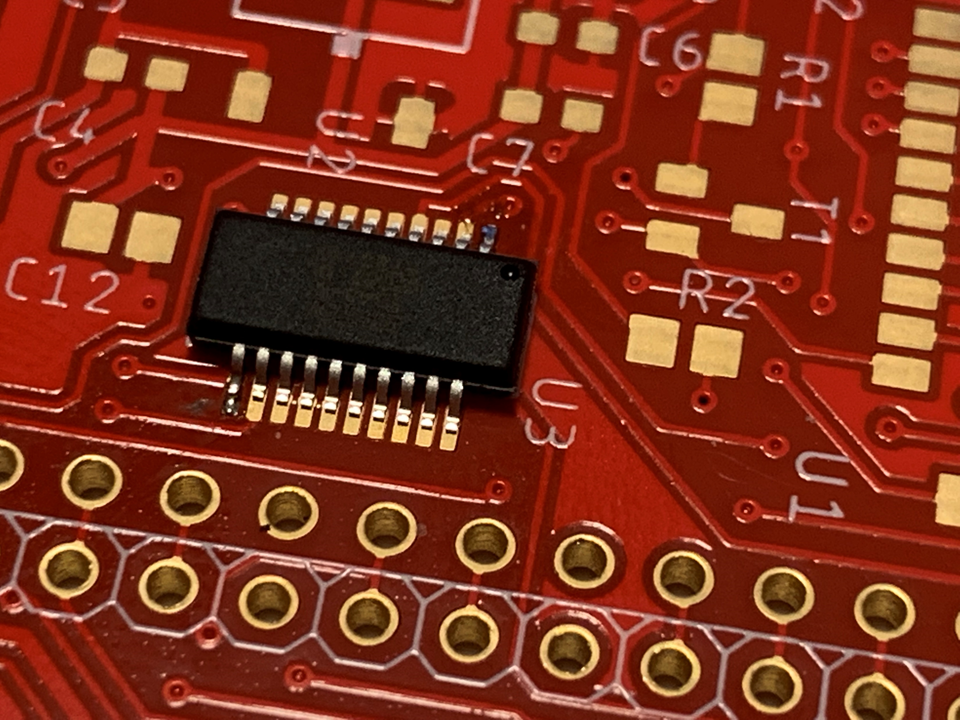

最後に残りのランドのはんだ付けをします。  
はんだ付けでピン間をショートさせてしまった場合は、はんだ吸い取り線などで余分なはんだを取り除いてフラックスを塗り、ピン間をこてで切るようにするとショートを解消できたりします。  

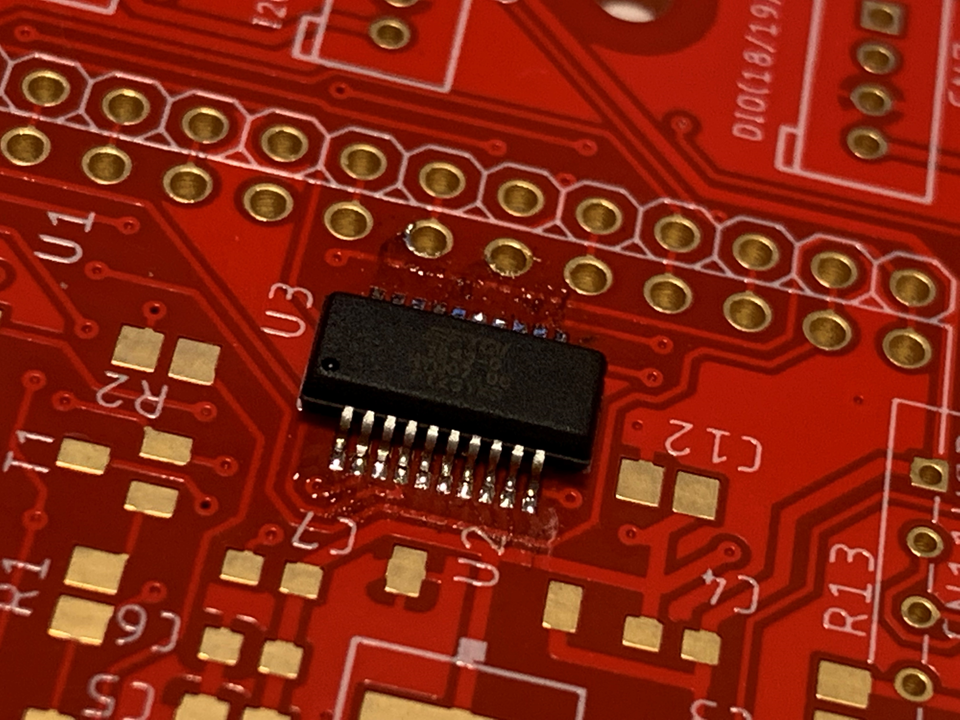

[↑ Back to Index](#S0)

---

#### <a name="1-2-2">1-2-2. microUSBコネクタ(CN4USB)</a>
microUSBコネクタのはんだ付けにおいては、同様に1つのランド(1番ピンのランド)に予備はんだを盛ります。  
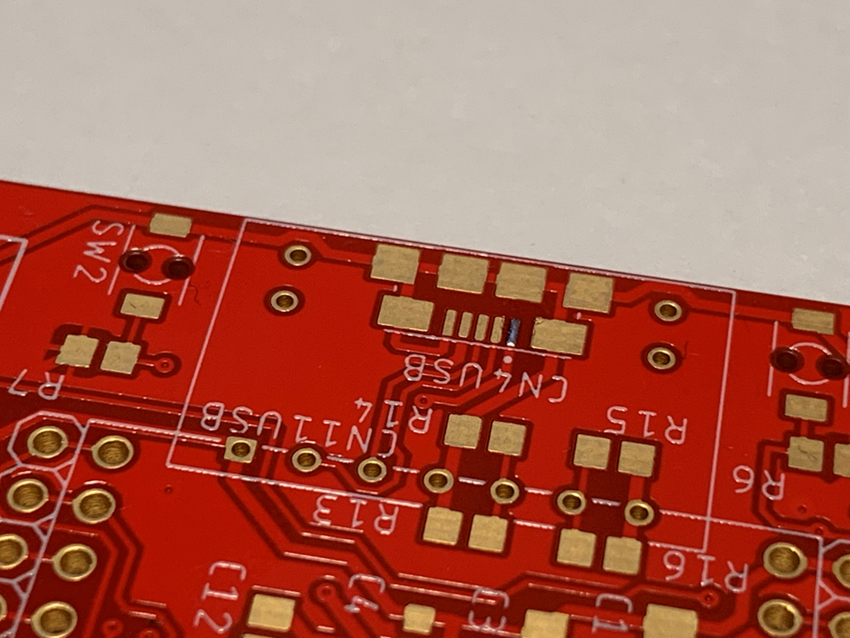

その上で、全ピンの位置を慎重に合わせ、信号線部分のはんだ付けを行います。  
ここでもはんだ付けでピン間をショートさせてしまった場合は、はんだ吸い取り線などで余分なはんだを取り除いてフラックスを塗り、ピン間をこてで切るようにするとショートを解消できたりします。  
最後にコネクタのフレーム部分の周り4箇所のはんだ付けを行います。  
(フレーム部分のはんだ受けは強度を出すためにはんだを少し多めにします。)
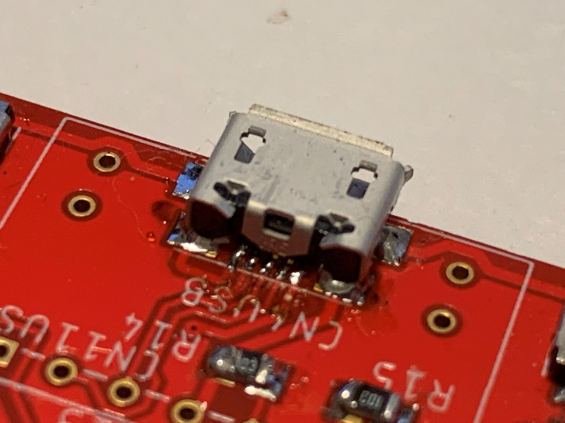

[↑ Back to Index](#S0)

---

#### <a name="1-2-3a">1-2-3a. チップLED(LED1、LED2、LED3)</a>
チップLED(LED1、LED2、LED3)は、フルカラーRGB LED(LED4)と **排他(※)** で実装します。  
※)チップLED(LED1、LED2、LED3)とフルカラーRGB LED(LED4)を両方実装すると、**電気的な特性から正常に光りません**。このため、片方のみを実装します。  

またチップLED(LED1、LED2、LED3)には、方向があります。  
下の写真のようにカソード側にマークがついています。  
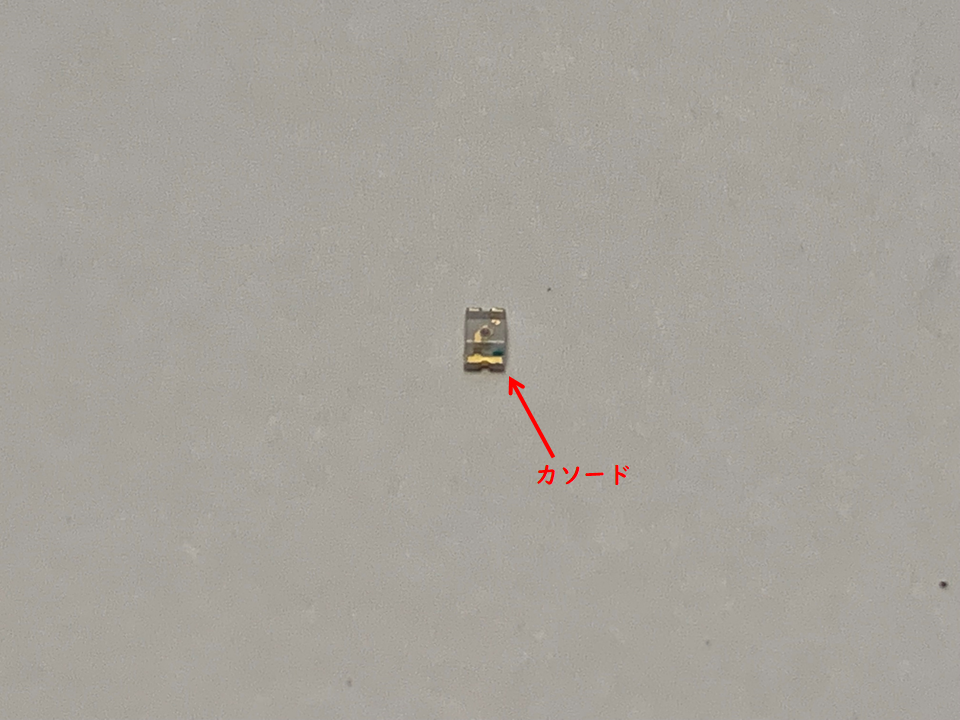

チップLED(LED1、LED2、LED3)のはんだ付けにおいては、片側のランドに予備はんだを盛ります。  
予備はんだを盛るランドは、GNDのようなベタパターンと繋がっていない方に行います。  
(ベタパターンと繋がっているランドには、はんだごての熱が伝わりにくく、はんだがのりにくいので避けます。)  
カソードが基板の外側に来る(写真の)ようにはんだ付けします。  
最初は、予備はんだを付けたランドにLEDをピンセットで摘まんで、位置を合わせて予備はんだをこてで溶かして取り付けます。  
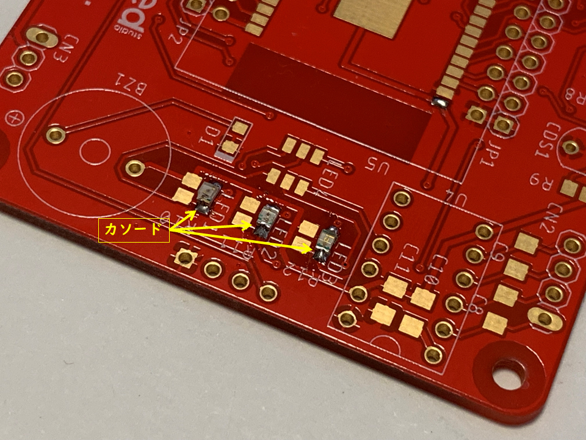

[↑ Back to Index](#S0)

---

#### <a name="1-2-3b">1-2-3b. フルカラーRGB LED(LED4)</a>
フルカラーRGB LED(LED4)にも、方向があります。  
下の写真のようにカソード側にマークがついています。  

フルカラーRGB LED(LED4)のはんだ付けにおいては、6つのランド(※)の内、1つのランドに予備はんだを盛ります。  
予備はんだを盛るランドは、コーナーやその近くでGNDのようなベタパターンと繋がっていない方に行います。  
(ベタパターンと繋がっているランドには、はんだごての熱が伝わりにくく、はんだがのりにくいので避けます。)  

カソードがLED4の「4」の文字の方に来るようにはんだ付けします。  
最初は、予備はんだを付けたランドにLEDをピンセットで摘まんで、位置を合わせて予備はんだをこてで溶かして取り付けます。  

次に対角のランドのはんだ付けをします。  
はんだ付けのコツは、まずこてで基板のランドを1、2秒ぐらい温めます。
その後、はんだを流してつけます。  

最後に残りのランドのはんだ付けをします。

[↑ Back to Index](#S0)

---

#### <a name="1-2-4">1-2-4. チップダイオード(D1)</a>
チップダイオード(D1)にも、方向があります。  
下の写真のようにカソード側にマークがついています。  

このチップダイオード(D1)のはんだ付けにおいても、同様に片側のランドに予備はんだを盛ります。  
以下の写真は、D1のランド(アノード側)に予備はんだを盛った状態です。  
(カソード側がベタパターンに繋がっているのでアノード側に予備はんだを盛ります。)

D1のシルクの白いバーの側にカソードが来るようにはんだ付けします。　　

[↑ Back to Index](#S0)

---

#### <a name="1-2-5">1-2-5. チップ抵抗(R3、R4、R5、R10、R11、R12)</a>
チップ抵抗には、表と裏があります。3桁の数字が書いてある黒い面が表で、白い面は裏です。  
表裏を逆にはんだ付けしても、動作には影響ありませんが、表面が見えるようにはんだ付けしましょう。  
片側のはんだ付けが出来たら、反対側をはんだ付けします。  

以下の写真は、R10、R11、R12のランドに予備はんだを盛った状態です。

以下の写真は、チップ抵抗(R10、R11、R12)のはんだ付けが終わった状態です。  
チップ抵抗(R3、R4、R5)も同様にはんだ付けを行います。

[↑ Back to Index](#S0)

---

#### <a name="1-2-6">1-2-6. チップ抵抗(R1、R2、R6、R7、R8、R9)</a>
チップ抵抗(R1、R2、R6、R7、R8、R9)も、抵抗値を間違えないように、注意し同様にはんだ付けを行います。

[↑ Back to Index](#S0)

---

#### <a name="1-2-7">1-2-7. チップ抵抗(R13、R14、R15、R16)</a>
チップ抵抗(R13、R14、R15、R16)は、USB Type-Cコネクタモジュールを使うためのものです。  
USB Type-Cコネクタモジュールを使用しない場合は、実装不要です。  
これも、抵抗値を間違えないように、注意し同様にはんだ付けを行います。

[↑ Back to Index](#S0)

---

#### <a name="1-2-8">1-2-8. チップトランジスタ(T1、T2)</a>
以下の写真は、チップトランジスタ(T1、T2)のはんだ付けが終わった状態です。  
チップトランジスタ(T1、T2)も同様にはんだ付けを行います。
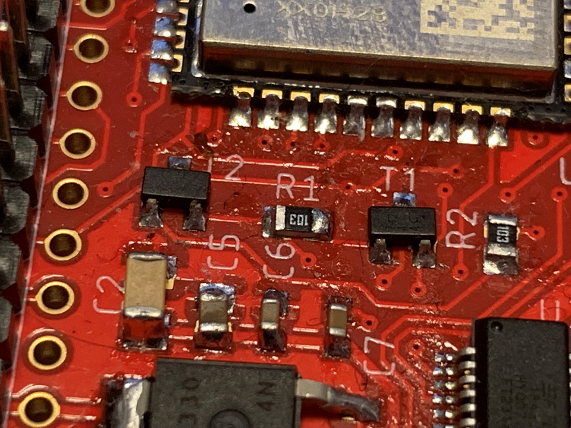

[↑ Back to Index](#S0)

---

#### <a name="1-2-9">1-2-9. チップコンデンサ(C3、C5、C12)</a>
以下の写真は、チップコンデンサのはんだ付けが終わった状態です。  
チップコンデンサ(C3、C5、C12)も同様にはんだ付けを行います。
(チップサイズはセットにより写真と異なる場合があります。)
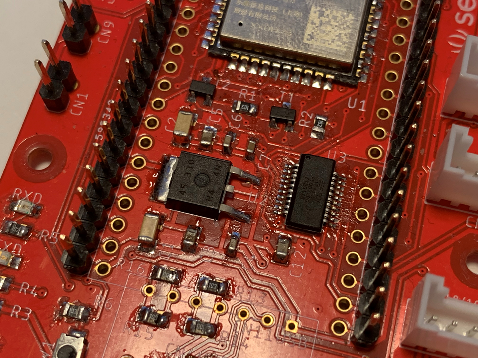

[↑ Back to Index](#S0)

---

#### <a name="1-2-10">1-2-10. チップコンデンサ(C4、C6、C7)</a>
前記の写真は、チップコンデンサのはんだ付けが終わった状態です。  
チップコンデンサ(C4、C6、C7)も同様にはんだ付けを行います。
これも、容量を間違えないように、注意し同様にはんだ付けを行います。
(チップサイズはセットにより写真と異なる場合があります。)

またC7は、0.01uFの部品を実装した場合、プログラム書き込みツールの種類によっては、**正常に書き込みができずエラーが発生する**場合があります。
この場合は、**0.1uFのチップコンデンサに付け替える**ことでエラーが発生しなくなる場合があります。

[↑ Back to Index](#S0)

---

#### <a name="1-2-11">1-2-11. チップコンデンサ(C1、C2)</a>
前記の写真は、チップコンデンサのはんだ付けが終わった状態です。  
チップコンデンサ(C1、C2)も同様にはんだ付けを行います。

[↑ Back to Index](#S0)

---

#### <a name="1-2-12">1-2-12. 3端子レギュレーター(U2)</a>

[↑ Back to Index](#S0)

---

#### <a name="1-2-13">1-2-13. Wi-Fiモジュール ESP32-WROOM-32D(U1)</a>
次は大物のWi-Fiモジュール ESP32-WROOM-32D(U1)のはんだ付けです。
これも、チップ抵抗と同様に予備はんだを盛りますが、盛る場所はまずGNDに繋がるピンを避け、角に近い1ピン、25ピンの2ヶ所にして、位置がずれないように注意しながらはんだ付けして行きます。  

以下の写真は、1ピン、25ピンの2ヶ所のランドに予備はんだを盛った状態です。
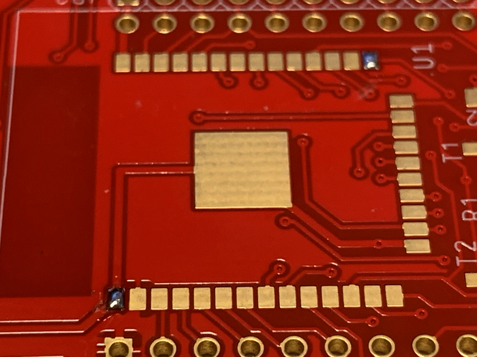

位置ずれなく、2ヶ所のピンのはんだ付けが出来たら、残りのピンをはんだ付けしていきます。  
このモジュールのはんだ付けには、[フラックスペン](https://www.amazon.co.jp/dp/B00SKSJFZA)を使うと綺麗に出来上がります。  

[↑ Back to Index](#S0)

---

#### <a name="1-2-14">1-2-14. 表面実装タクトスイッチ(SW1、SW2、SW3)</a>
表面実装タクトスイッチ(SW1、SW2、SW3)は、裏面に小さなピンが出ています。  
このピンを基板の穴に嵌められるため、**予備はんだをせずにはんだ付け**を行います。  

以下の写真は、表面実装タクトスイッチ(SW3)までのはんだ付けが終わった状態です。

[↑ Back to Index](#S0)

---

#### <a name="1-2-15">1-2-15. CdSセル(U3)</a>
CdSセル(CDS1)は、方向のないリード部品です。  
基板の穴にリードを差し込んで、裏から出たリードをすこし外側に広げて余分なリードをニッパで切断します。  
切断した上で、裏面からリードをはんだ付けします。  
写真では、作業台を使って基板を挟んだ状態になっていますが、作業台は使わなくてもOKです。

以下の写真は、CdSセル(CDS1)を基板の穴に差し込んだ状態です。  

以下の写真は、CdSセル(CDS1)を基板の穴に差し込んだのを裏から見て余分なリードを切断した状態です。

以下の写真は、CdSセル(CDS1)のはんだ付けが終わった状態です。

[↑ Back to Index](#S0)

---

#### <a name="1-2-16">1-2-16. ピンヘッダ(JP1、JP2)</a>
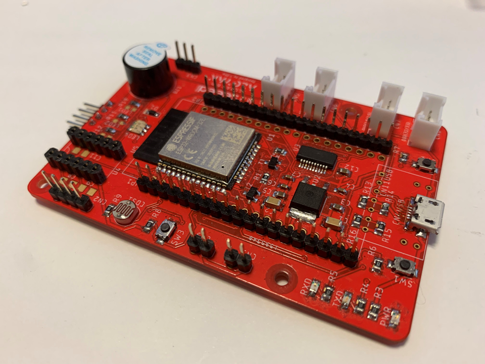

[↑ Back to Index](#S0)

---

#### <a name="1-2-17">1-2-17. 電子ブザー(SP1)</a>
電子ブザー(BZ1)は、方向があるリード部品です。  
電子ブザー(BZ1)の上部に貼ってあるシールの「+」の方のリードを基板上の「+」のシルクに合わせて基板の穴にリードを差し込みます。  

その上で、裏から出たリードをすこし外側に広げて余分なリードをニッパで切断し、裏面からリードをはんだ付けします。  

以下の写真は、電子ブザー(BZ1)のはんだ付けまでが終わった状態です。

[↑ Back to Index](#S0)

---

#### <a name="1-2-18">1-2-18. ピンヘッダ(CN1、CN9、CN3、CN4)</a>
各コネクタ用のピンヘッダを同様にはんだ付けします。  
コネクタCN2、CN9は、モータドライバDRV8835のモータ駆動用コネクタなので、モータ駆動をしない場合は取り付け不要です。  
コネクタCN3はサーボモータ駆動用コネクタなので、サーボモータを駆動しない場合は取り付け不要です。  

各コネクタのはんだ付けのときも各1本のピンだけはんだ付けが終わったところで、基板からピンヘッダが浮いていないか、曲がっていないかを確認します。  
浮いていたり、曲がっていたらこのときに修正します。  
1本のピンのはんだ付けに問題なければ、残りのピンのはんだ付けをします。  
以下の写真はSet A(お手軽)でのものですが、同じように実装します。

コネクタCN2、CN9をはんだ付けして、モータドライバDRV8835を取り付け、モータ駆動をする場合は、さらに基板裏側のSJ3の片側をはんだ付けしてショートさせる必要があります。  
以下の写真の場合は、CN9からモータ駆動用外部電源を供給する場合のパターンショートの例です。  
CN1の外部電源から供給させる場合は、反対側をショートさせます。

[↑ Back to Index](#S0)

---

#### <a name="1-2-19">1-2-19. Groveコネクタ(CN5、CN6、CN7、CN8)</a>
Groveコネクタ用には方向があります。  
シルクの形状(写真の向き)に合わせ嵌めて、はんだ付けします。  
このときも各1本のピンだけはんだ付けが終わったところで、基板からコネクタが浮いていないか、曲がっていないかを確認します。  
浮いていたり、曲がっていたらこのときに修正します。  
1本のピンのはんだ付けに問題なければ、残りのピンのはんだ付けをします。  
以下の写真はSet A(お手軽)でのものですが、同じように実装します。

GroveコネクタCN6でUART2通信をする場合は、さらに基板裏側のSJ1、SJ2の片側をはんだ付けしてショートさせる必要があります。  
以下の写真の場合は、GroveコネクタCN6でUART2通信をする場合のパターンショートの例です。  
GroveコネクタCN6でI2C通信をする場合は、反対側をショートさせます。

[↑ Back to Index](#S0)

---

#### <a name="1-2-20">1-2-20. USB Type-Cコネクタ(CN11USB)</a>
まず、キットのヘッダピンをモジュールにはんだ付けします。
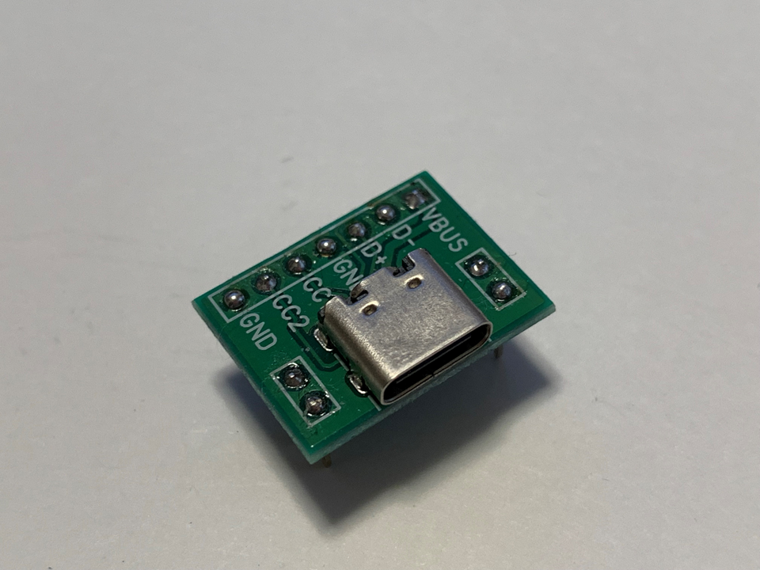
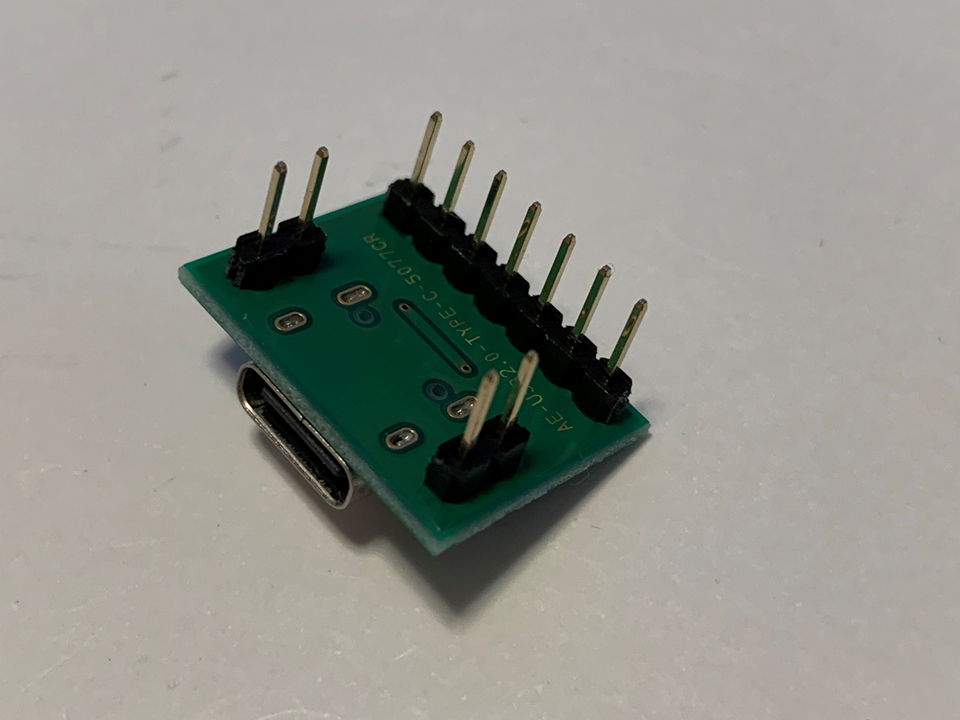

その上で、モジュールを基板に取り付け、はんだ付けします。  
(穴が少し小さくピンの挿入がきついですが、力を加えて押し込みます。)
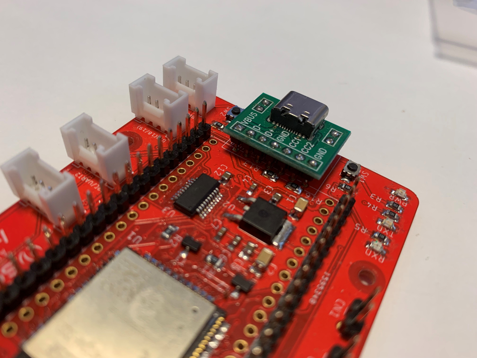

[↑ Back to Index](#S0)

---
